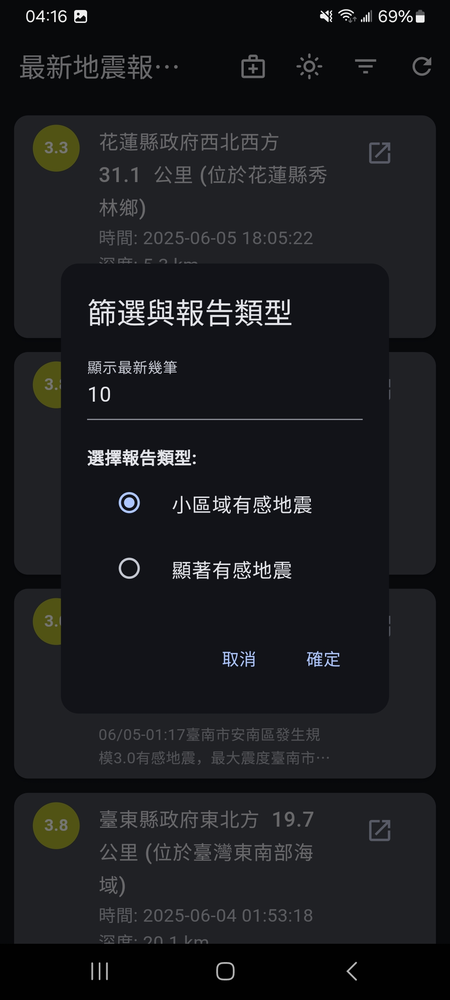

# earthquake_viewer_app

一個使用 Flutter 開發的簡易即時地震資料APP，並整合了輕量級的防災輔助功能。

本專案旨在提供一個簡潔、直觀且反應快速的介面，讓使用者能輕鬆查閱由台灣中央氣象署（CWA）發布的最新地震報告，並在緊急情況下提供必要的輔助工具。

## 功能特色 ✨

* **即時地震報告**：串接中央氣象署開放資料API，即時顯示最新地震列表。
* **客製化篩選**：可自由切換查閱「顯著有感地震」或「小區域有感地震」，並能自訂顯示的資料筆數。
* **詳細資訊與報告圖**：點擊任一地震可查看詳細資訊，包括官方報告摘要、震度分佈圖（支援手勢縮放檢視）。
* **主題模式切換**：支援明亮與暗黑兩種主題模式，並以藍色系作為主色調，提供舒適的視覺體驗。
* **前景本地通知**：當APP在前景或使用者手動刷新時，若偵測到新的地震事件，會發送本地通知提醒。
* **緊急應變工具**：
    * **快速撥號**：內建119/110快速撥號鍵，並可讓使用者自行設定最多3位緊急聯絡人。
    * **手電筒**：一鍵開關手機閃光燈。
    * **防災須知**：內建可離線查閱的「地震應對SOP」與「緊急避難包」建議清單。

## 應用程式截圖 📸

| 主畫面 (暗黑模式) | 緊急工具頁 | 詳細資訊彈窗 |
| :---: | :---: | :---: |
|  |  |  |
| **防災須知 (SOP)** | **管理緊急聯絡人** | **全螢幕報告圖** |
|  |  |  |

## 安裝與設定 🚀

### 1. 環境準備

請確保您的開發環境中已安裝好 [Flutter SDK](https://flutter.dev/docs/get-started/install)。

### 2. 取得專案

```bash
git clone [您的專案Git儲存庫網址]
cd earthquake_viewer_app
```

### 3. 取得中央氣象署 API 金鑰

本專案需要使用中央氣象署的 API 金鑰才能獲取地震資料。

1.  前往 [中央氣象署開放資料平臺](https://opendata.cwa.gov.tw/)。
2.  註冊成為會員並登入。
3.  在會員中心申請一組 API 授權碼（API Key）。

### 4. 設定 API 金鑰

將您取得的 API 金鑰填入專案中：

* 打開檔案： `lib/services/earthquake_api_service.dart`
* 找到以下這行程式碼：
    ```dart
    static const String _apiKey = 'YOUR_CWA_API_KEY';
    ```
* 將 `'YOUR_CWA_API_KEY'` 替換為您真實的 API 金鑰。

### 5. 安裝套件與執行

在專案根目錄下，執行以下指令：

```bash
# 下載所有需要的套件
flutter pub get

# 執行應用程式
flutter run
```

## 主要使用套件 📦

* `http`: 用於發送網路請求，獲取API資料。
* `intl`: 用於日期和時間的格式化。
* `shared_preferences`: 用於本地儲存使用者偏好設定。
* `flutter_local_notifications`: 用於實現本地新地震通知。
* `url_launcher`: 用於撥打電話。
* `photo_view`: 用於實現圖片的縮放和拖曳查看。
* `torch_controller`: 用於控制手機手電筒。

## 未來展望 🔭

* **地圖整合**：引入地圖元件，在地圖上直觀地標示震央位置。
* **歷史地震查詢**：加入查詢特定日期或地區歷史地震的功能。
* **更詳細的震度資訊**：用列表或圖表詳細展示各縣市的觀測震度。
* **啟用網頁連結**：將「CWA詳細報告」按鈕的功能正式啟用。

---

這個專案是作為「安全耐震我的家」通識課程的期末報告而開發，旨在將資訊工程專業與地震防災知識相結合。
